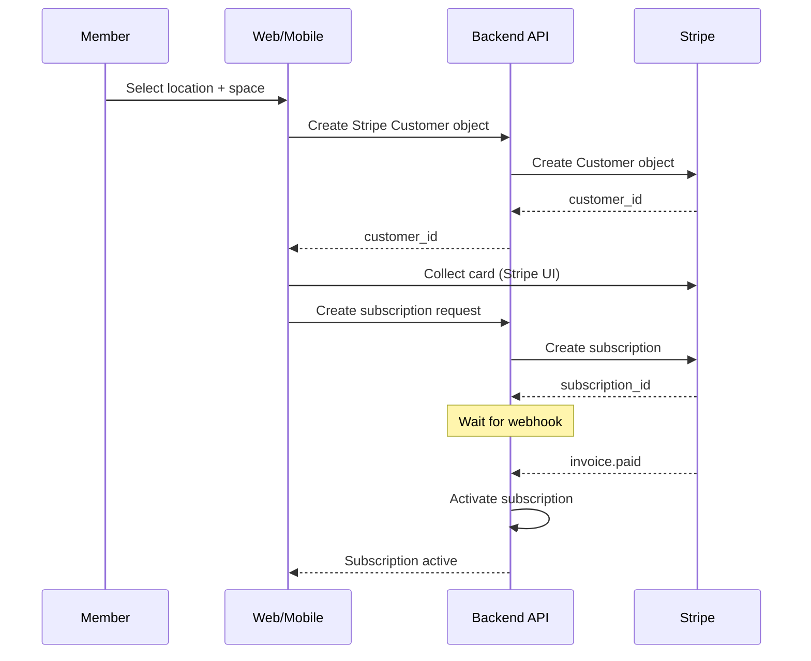
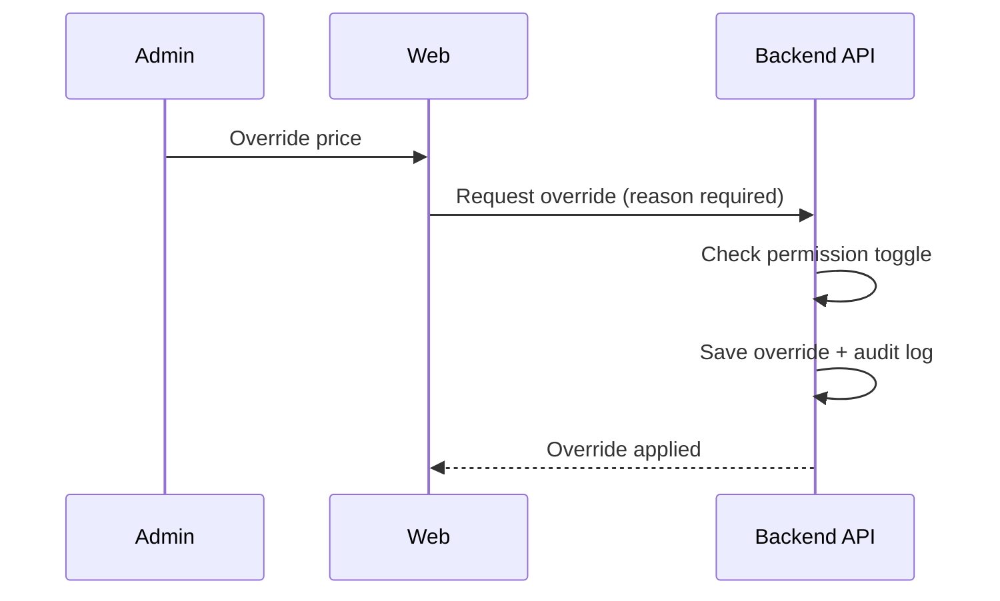
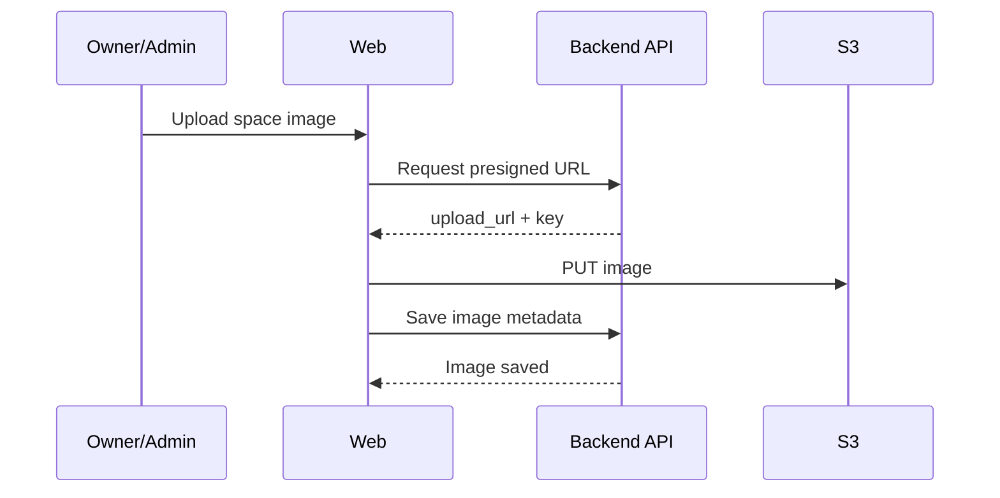
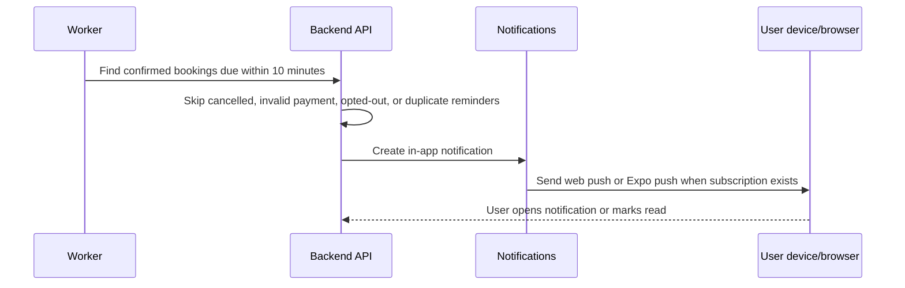

# Product Flows

## 1) Membership flow (member, optional)


## 2) Booking flow (request-to-book default)

Instant booking can be enabled per tenant or space via feature flag; when enabled, payment is collected immediately and the booking auto-confirms.

## 3) Pricing override (admin)


## 4) Booking conflict rule
- Prevent overlaps with CONFIRMED bookings or active memberships.

## 5) Space image upload (owner/admin)


## 6) Cancellation policy (tiered)
- Cancellation window and refundability are set by space type and enforced server-side.

## 7) Space Access Pass QR flow
Access passes are created for confirmed bookings only. An approved request that is still waiting on payment does not produce a usable pass until the booking becomes `CONFIRMED`.

```mermaid
sequenceDiagram
  participant M as Member or Guest
  participant W as Web/Mobile
  participant API as Backend API
  participant R as Reception/Owner/Admin

  M->>W: Booking request is approved or auto-approved
  W->>API: Payment succeeds or guest booking is confirmed
  API->>API: Create one SpaceAccessPass for the confirmed booking
  API->>M: Member app shows QR; guest email includes QR PNG + fallback link
  R->>W: Scan QR or paste fallback token
  W->>API: Resolve secure token
  API-->>W: Member, booking, location, space, and pass status
  R->>API: Check in
  API->>API: Validate token, booking status, payment state, location scope, and booking window
  API->>API: Store attendance record and booking check-in timestamp
  API-->>W: Status = already checked in
  R->>API: Optional check-out
  API->>API: Store checkout attendance record and booking checkout timestamp
```

### Access pass rules
- QR payloads contain only a secure token/fallback URL, not raw booking or member details.
- Tokens are stored as HMAC hashes plus encrypted token material for member display and email delivery.
- Check-in is valid from booking start through booking end, enforced server-side.
- Cancelled, rejected, refunded, voided, expired, checked-out, or otherwise invalid bookings cannot check in.
- Duplicate check-ins and duplicate check-outs are blocked by a unique attendance event per booking.
- Existing booking check-in actions also create attendance records and use the same access-pass validity window.

### Role and privacy rules
- Members see only their own valid/upcoming passes.
- Guests use the email QR or fallback link without logging in; expired or cancelled guest passes show status without a usable QR.
- Owners see scanner and attendance only for their own locations.
- Owner admins and staff see assigned locations only.
- Platform admins/superadmins/support can scan and view attendance across all locations.
- Member directory is read-only and limited to people with active memberships or recent confirmed bookings at the same locations as the requesting member.

## 8) Booking reminder notification flow


Rules:
- Booking-start reminders default on for members and owner-side team members.
- Booking-end reminders default on, but only send for `conference_room` meeting-room bookings.
- Owner/admin/staff reminders follow existing organization and location access scope.
- In-app notifications are created even when browser/mobile push permission is missing.
