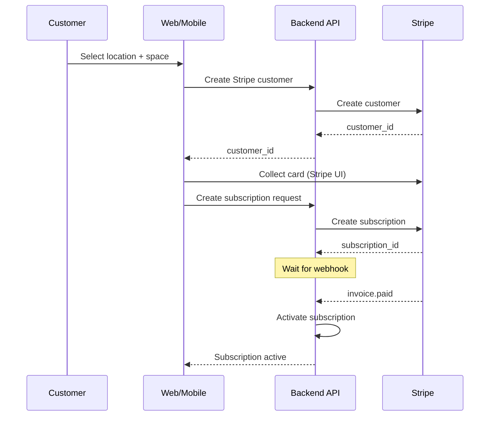
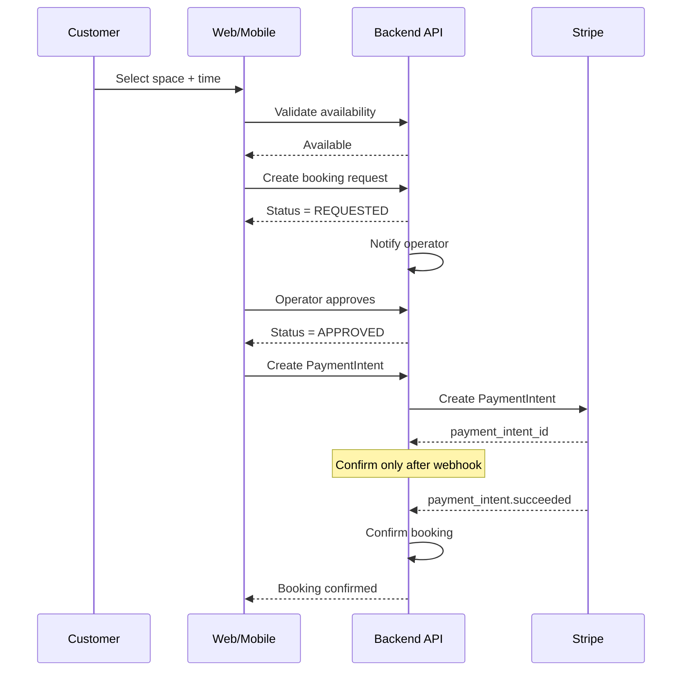
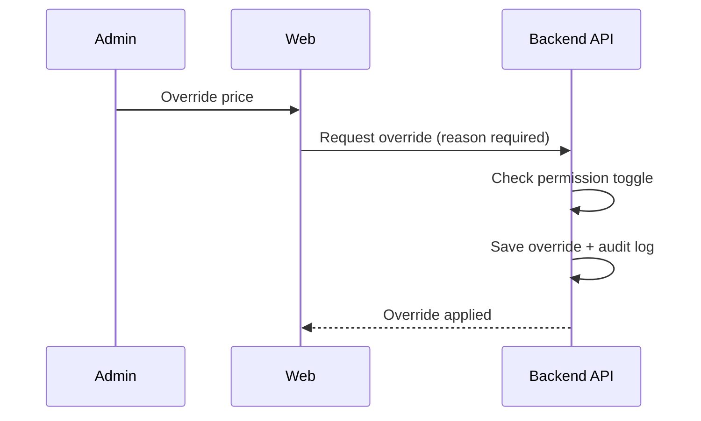
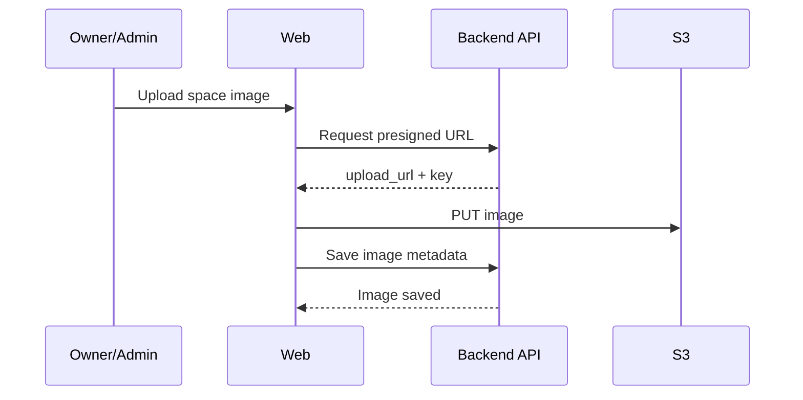

# Product Flows

## 1) Membership flow (customer, optional)

## 2) Booking flow (request-to-book default)

Instant booking can be enabled per tenant or space via feature flag; when enabled, payment is collected immediately and the booking auto-confirms.

## 3) Pricing override (admin)

## 4) Booking conflict rule
- Prevent overlaps with CONFIRMED bookings or active memberships.

## 5) Space image upload (owner/admin)

## 6) Cancellation policy (tiered)
- Cancellation window and refundability are set by space type and enforced server-side.
