# Priddyspaces Role Flow Guide

This guide explains how the current Priddyspaces app works for owners, members,
and platform super admins. It covers registration URLs, onboarding, login,
location and space setup, payment readiness, approval routing, rewards, and the
main role-specific workflows.

The screenshots in this guide were captured from the local Next.js app with
Playwright, Clerk bypass, and mocked API data. They show app-owned screens.
Clerk-hosted sign-up/sign-in internals and third-party card entry iframes are
described in text because they require a real Clerk or payment-provider test
environment.

Use `http://localhost:3000` for local URLs. For staging or production, replace
only the origin with the deployed app domain.

## Role Summary

| Role | Primary URLs | Main responsibility |
|---|---|---|
| Member | `/sign-up`, `/sign-in`, `/spaces`, `/member/*` | Browse listings, request bookings, manage payment methods, invoices, access passes, memberships, and rewards. |
| Owner | `/owners/sign-up`, `/sign-in`, `/owner/*` | Onboard a business, configure locations/spaces/payments, request marketplace approval, manage requests, members, team, loyalty, marketing, and analytics. |
| Platform admin/support | `/sign-in`, `/admin/*` | Review platform data. Support is read-oriented. Admins can update owner company review state where allowed. |
| Superadmin | `/sign-in`, `/admin/*` | Full platform operations, owner company approval, platform team, platform settings, rewards defaults, audit logs, and impersonation. |

## One-Time Setup

### Local app startup

From the repo root:

```bash
docker compose up -d --build
```

This starts Postgres on `localhost:5433` and the backend API on
`http://localhost:8000`.

For the web app:

```bash
cd webUI
npm install
npm run dev
```

Visit `http://localhost:3000`.

### Required configuration

Backend auth and payment configuration is documented in
[`docs/auth.md`](./auth.md) and
[`docs/clerk-auth-onboarding.md`](./clerk-auth-onboarding.md). The key split is:

| Concern | Source of truth |
|---|---|
| Identity, passwords, OAuth, email verification, MFA | Clerk |
| App role (`member` or `owner`) | Backend onboarding plus Clerk public metadata |
| Platform role (`superadmin`, `admin`, `support`) | Clerk public metadata synced to Postgres |
| Locations, spaces, bookings, payments, invoices, rewards | Postgres |

For production Clerk sign-in, each protected request sends a Clerk session JWT
as `Authorization: Bearer <token>`. The backend verifies the JWT, resolves the
local user row, and applies app-role, platform-role, organization, and
location-scoped permissions.

### Test users

Use only test users in local and E2E data:

| Role | Email | Password |
|---|---|---|
| Superadmin | `admin@test.com` | `Password123!` |
| Owner | `owner@test.com` | `Password123!` |
| Member | `customer@test.com` | `Password123!` |
| Team | `team@test.com` | `Password123!` |

### Superadmin setup

Platform admins are not created through normal member or owner registration.
They are created in Clerk and given platform metadata:

```json
{ "platform_role": "superadmin" }
```

The Clerk webhook creates or updates the local platform team member row. A
superadmin can then log in at `/sign-in` and lands on `/admin` through the
`/dashboard` role router.

### Marketplace prerequisites

An owner company needs these items before public listings can fully work:

1. Owner account created through `/owners/sign-up`.
2. Owner profile and business onboarding completed at `/onboarding/owner`.
3. At least one location.
4. At least one active public space.
5. Payment provider configured and enabled for the organization or location.
6. Owner company submitted for marketplace review.
7. Superadmin/admin approval from `/admin/owner-companies`.

If payment setup is missing or incomplete, public listings are hidden from
marketplace search and booking attempts can be blocked with a payment readiness
error.

## Registration, Login, and Onboarding

### Canonical URLs

| Flow | Local URL |
|---|---|
| Member registration | `http://localhost:3000/sign-up` |
| Owner registration | `http://localhost:3000/owners/sign-up` |
| Owner invite registration | `http://localhost:3000/owners/sign-up?email=owner@example.com&invite=owner` |
| Login | `http://localhost:3000/sign-in` |
| Role router after auth | `http://localhost:3000/dashboard` |
| Member onboarding | `http://localhost:3000/onboarding/member` |
| Owner onboarding | `http://localhost:3000/onboarding/owner` |

Legacy `/register` and `/login` routes redirect to the Clerk-backed
`/sign-up` and `/sign-in` pages.

### Default routing

After sign-in, `/dashboard` calls `/api/me` and sends users to the correct home:

| Condition | Route |
|---|---|
| Platform role exists | `/admin` |
| No app role yet | `/onboarding/member` |
| Owner role without an organization | `/onboarding/owner` |
| Owner role with organization | `/owner` |
| Member role | `/spaces` |

### Registration flow diagram

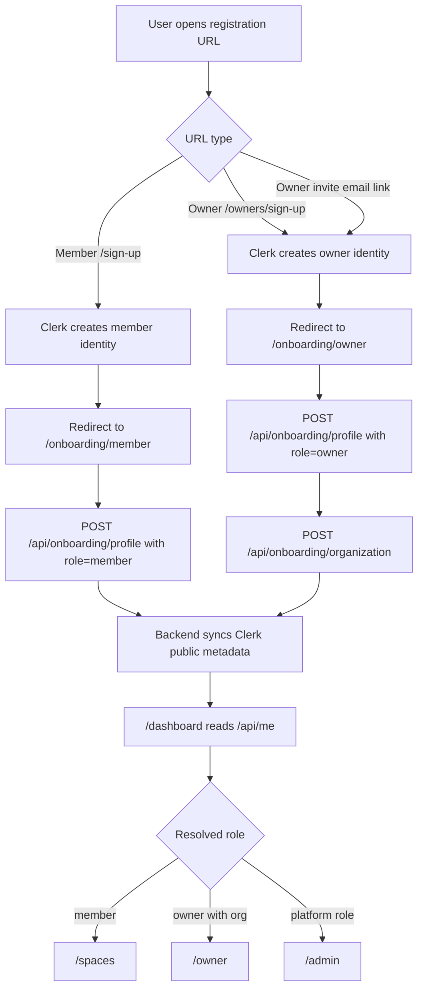
```mermaid
flowchart TD
  A["User opens registration URL"] --> B{"URL type"}
  B -->|"Member /sign-up"| C["Clerk creates member identity"]
  B -->|"Owner /owners/sign-up"| D["Clerk creates owner identity"]
  B -->|"Owner invite email link"| D
  C --> E["Redirect to /onboarding/member"]
  D --> F["Redirect to /onboarding/owner"]
  E --> G["POST /api/onboarding/profile with role=member"]
  F --> H["POST /api/onboarding/profile with role=owner"]
  H --> I["POST /api/onboarding/organization"]
  G --> J["Backend syncs Clerk public metadata"]
  I --> J
  J --> K["/dashboard reads /api/me"]
  K --> L{"Resolved role"}
  L -->|"member"| M["/spaces"]
  L -->|"owner with org"| N["/owner"]
  L -->|"platform role"| O["/admin"]
```

### Member registration and onboarding

1. Open `/sign-up`.
2. Clerk handles account creation, password, email verification, social OAuth,
   MFA, and session creation.
3. The app redirects to `/onboarding/member`.
4. The member enters full name, optional phone, country/timezone, and accepts
   Privacy Policy and Terms.
5. The app calls `POST /api/onboarding/profile` with `role: "member"`.
6. The backend updates the local user, grants eligible signup Priddy Points,
   syncs Clerk public metadata, and returns `default_route: "/spaces"`.

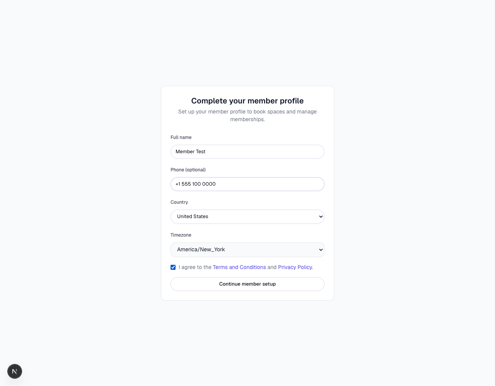

### Owner registration and onboarding

1. Open `/owners/sign-up`, or use the invite URL sent by a superadmin.
2. Clerk handles identity creation and email verification.
3. The app redirects to `/onboarding/owner`.
4. The owner enters personal profile data and business details:
   legal business name, optional display name, business email, business phone,
   website, and description.
5. The app calls `POST /api/onboarding/profile` with `role: "owner"`.
6. The app then calls `POST /api/onboarding/organization`.
7. The backend creates or updates the organization, adds the owner as an
   organization owner, seeds default amenities, marks onboarding complete, sets
   organization review status to `pending`, and sends approval email to
   configured superadmins.
8. The owner lands on `/owner`.

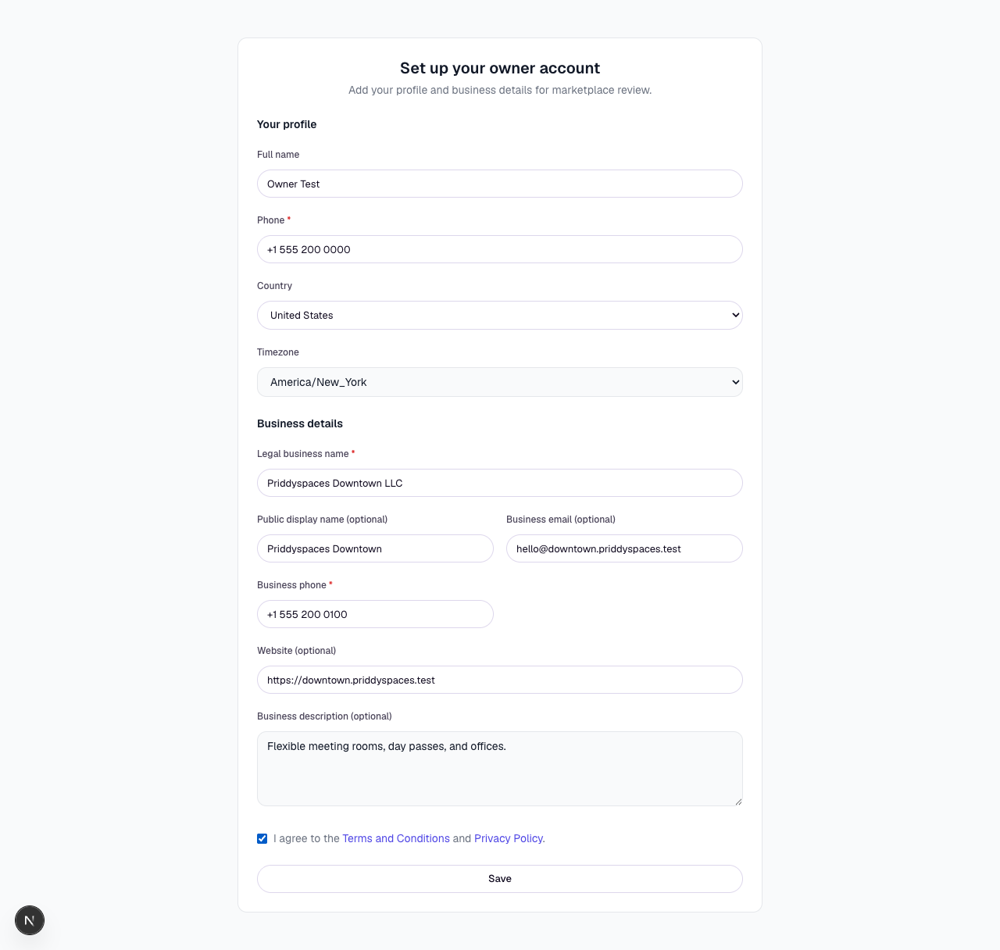

### Login

1. Open `/sign-in`.
2. Clerk authenticates the user.
3. Clerk redirects to `/dashboard`.
4. `/dashboard` calls `/api/me`.
5. The app routes to `/spaces`, `/owner`, `/onboarding/*`, or `/admin`.

## Owner Flow

Owners manage organizations, locations, spaces, payment settings, approval
requests, booking requests, team members, loyalty, marketing, analytics,
invoices, and payments.

### Owner setup to approval diagram

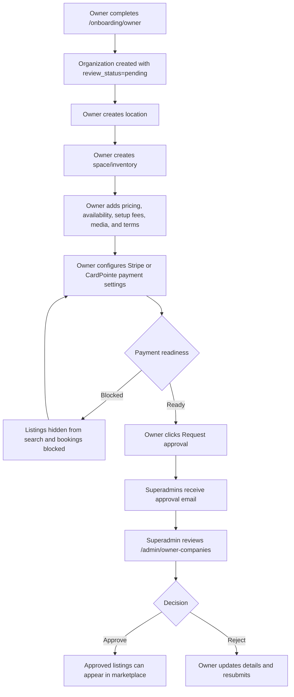
```mermaid
flowchart TD
  A["Owner completes /onboarding/owner"] --> B["Organization created with review_status=pending"]
  B --> C["Owner creates location"]
  C --> D["Owner creates space/inventory"]
  D --> E["Owner adds pricing, availability, setup fees, media, and terms"]
  E --> F["Owner configures Stripe or CardPointe payment settings"]
  F --> G{"Payment readiness"}
  G -->|"Blocked"| H["Listings hidden from search and bookings blocked"]
  G -->|"Ready"| I["Owner clicks Request approval"]
  H --> F
  I --> J["Superadmins receive approval email"]
  J --> K["Superadmin reviews /admin/owner-companies"]
  K --> L{"Decision"}
  L -->|"Approve"| M["Approved listings can appear in marketplace"]
  L -->|"Reject"| N["Owner updates details and resubmits"]
```

### Create a location

1. Go to `/owner/locations/new`.
2. Choose the organization.
3. Enter location name and address.
4. Add city, state, postal code, neighborhood, latitude/longitude if needed.
5. Confirm timezone and booking granularity.
6. Add public phone/email, working hours, parking notes, transit notes, included
   items, and amenities.
7. Save the location or save and continue to rooms.

The location feeds the owner location list and the public marketplace detail
page after review and payment readiness are satisfied.

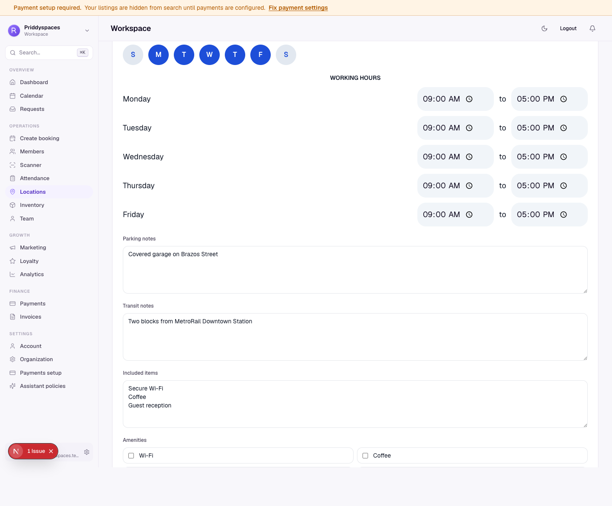

### Create a space

1. Go to `/owner/spaces/new`, optionally with `?locationId=<location_public_id>`.
2. Select location.
3. Enter listing name.
4. Choose space type:
   `conference_room`, `shared_desk`, `private_office`, `virtual_office`, or
   `suite`.
5. Enter capacity or seats where required.
6. Choose visibility: public, unlisted, or private.
7. Enter prices:
   conference rooms can use hourly and day rates, shared desks can use day pass
   pricing, and lease/membership products use their term or plan managers.
8. Configure availability start/end time and buffers where applicable.
9. Add one-time setup fees such as room setup or AV kit.
10. Save and add photos, or save the space.

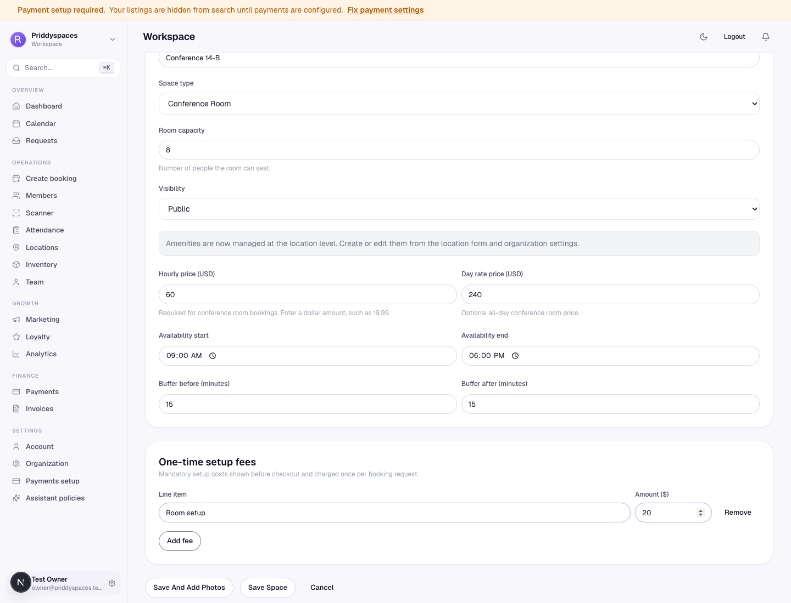

### One-time setup fees

One-time setup fees are mandatory line items shown before checkout and charged
once per booking request. They are included in the booking price preview and can
be taxed if a tax config applies.

Common examples:

| Fee | Usage |
|---|---|
| Room setup | Staff preparation before a room booking. |
| AV kit | Projector, display, microphone, or meeting hardware. |
| Cleaning | Post-booking cleaning or reset. |

### Media, terms, pricing, and inventory

Owners can also manage:

| Area | Owner route | What it controls |
|---|---|---|
| Photos/media | `/owner/spaces/media` | Space images uploaded through presigned media URLs. |
| Inventory | `/owner/locations/spaces` | Existing spaces by location. |
| Space edits | `/owner/spaces/edit` | Space details, price, visibility, and availability. |
| Floor plan | `/owner/locations/floor-plan` | Floor plan upload and workspace markers. |
| Booking settings | `/owner/settings` | Organization-level booking behavior, including approval mode. |
| Payment settings | `/owner/settings/payments` | Stripe/CardPointe setup and provider overrides. |
| Assistant policies | `/owner/settings/assistant-policies` | Owner-specific knowledge used by the assistant. |

### Payment setup

Owners configure payments at `/owner/settings/payments`.

Supported owner payment providers:

| Provider | Required fields |
|---|---|
| Stripe | Publishable key and secret key. Webhook secret can also be stored. |
| CardPointe | Merchant ID, username, password, gateway site, and tokenizer URL. |

Payment settings can be scoped by organization, with optional location-level
provider override. Members save payment methods per owner/provider, not just one
global card for every workspace.

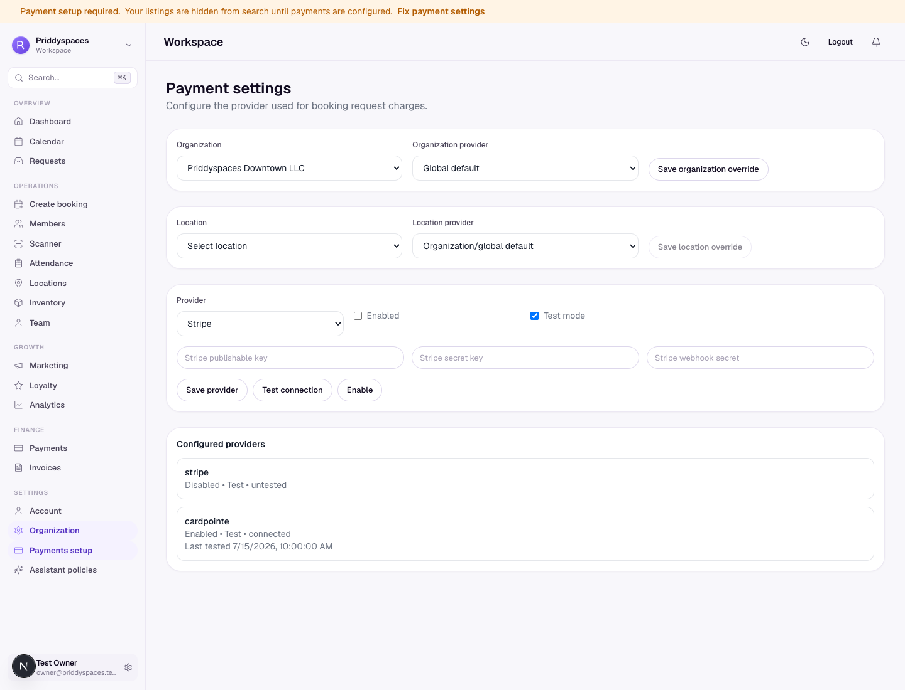

### Payment readiness blockers

Payment readiness is checked before a listing can be public-bookable. The app
can block marketplace visibility and booking when:

| Blocker | Result | Fix |
|---|---|---|
| Provider missing | Public listings are hidden and booking is blocked. | Create a Stripe or CardPointe setting for the organization. |
| Provider disabled | Listings remain blocked. | Enable the provider after credentials are complete. |
| Stripe incomplete | API returns `Payment provider setup incomplete`. | Add publishable key and secret key. |
| CardPointe incomplete | API returns missing merchant, username, password, gateway, or tokenizer details. | Complete all CardPointe fields. |
| Connection test failed | Readiness reports failed connection. | Fix credentials/site and rerun test. |
| Mixed or location override mismatch | Some listings may be ready and some hidden. | Confirm organization and location provider overrides. |

If payment setup is blocked, owners see a marketplace payment status warning
and hidden listing counts. Superadmins see payment blockers during company
review.

### Request marketplace approval

After the owner has location, space, and payment setup in place:

1. Go to `/owner/locations`.
2. Review marketplace status and payment blockers.
3. Click `Request approval`.
4. The backend calls `POST /api/orgs/{org_public_id}/approval-request`.
5. Superadmin recipients receive an email with links to view or approve the
   company in `/admin/owner-companies`.

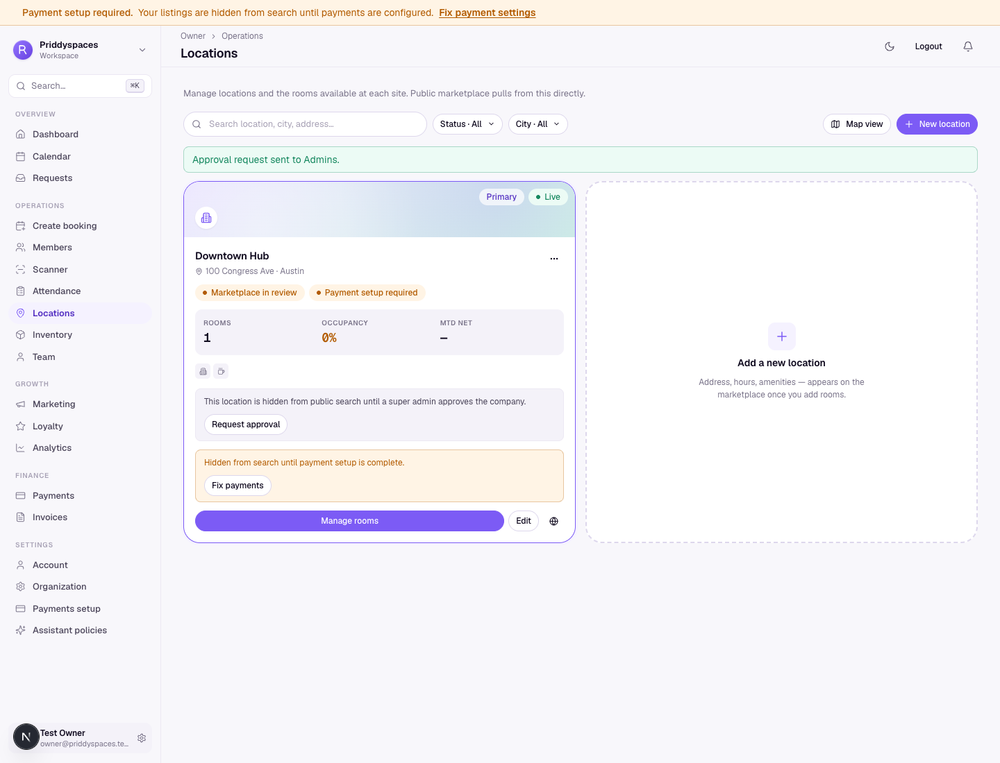

### Booking requests

Member booking requests route to owner-side users who can access that location:
owner, owner admin, or staff. They do not go to platform superadmins for normal
booking approval.

At `/owner/requests`, owner-side users can:

1. Filter requests by status.
2. Review requester, company, email, phone, location, space, date/time, price,
   payment status, and email delivery status.
3. Add operator notes.
4. Approve or reject the request.
5. Retry payment after payment failure where allowed.
6. Review guest checkout requests and membership or lease purchase requests.

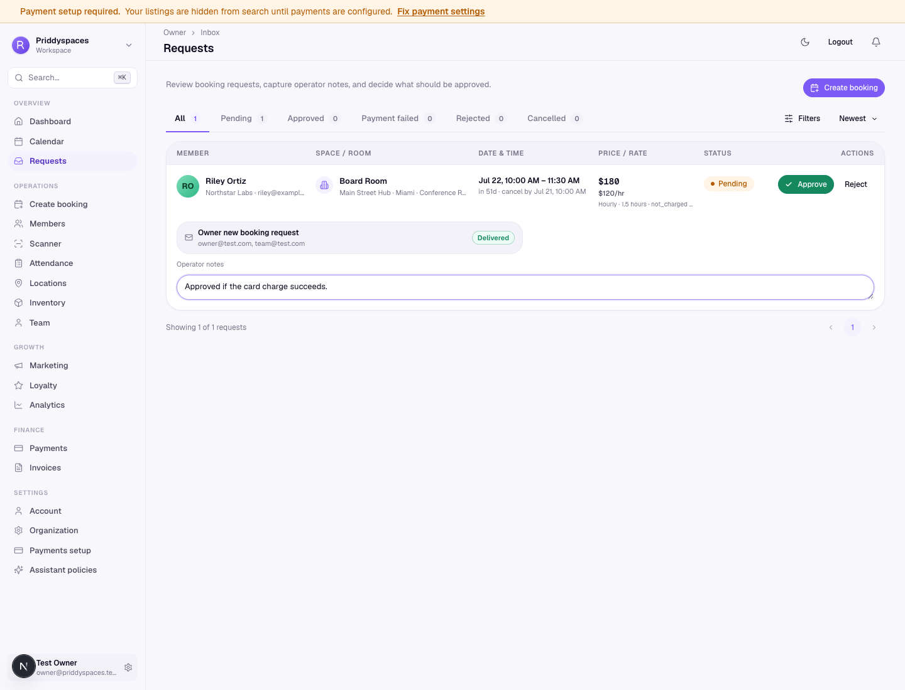

Approval behavior depends on organization settings:

| Mode | Behavior |
|---|---|
| Manual approval | Request stays `requested` until owner/admin/staff approves or rejects. |
| Auto approval | Booking hold and charge can happen immediately, then the request is approved if payment succeeds. |

If payment charge on approval is enabled, approval attempts to charge the
member's saved owner-specific payment method. A successful charge confirms the
booking and can create an access pass. A failed charge moves the request to
`payment_failed` or cancels it depending on hold settings.

### Owner operations after setup

| Area | Route | Owner can do |
|---|---|---|
| Dashboard | `/owner` | See owner activity and high-level metrics. |
| Calendar | `/owner/calendar` | Review bookings, holds, and requests by location/space. |
| Create booking | `/owner/bookings/new` | Create walk-in or owner-created bookings, including cash or payment-link flows. |
| Members | `/owner/members` | View members who interacted with owner locations. |
| Team | `/owner/team` | Invite owner/admin/staff users, control location access and notification preferences. |
| Payments | `/owner/payments` | View owner payment history. |
| Invoices | `/owner/invoices` | Review invoices for owner-related transactions. |
| Analytics | `/owner/analytics` | Revenue, occupancy, retention, peak hours, top members, and reports. |
| Loyalty | `/owner/loyalty` | Configure owner rewards, campaigns, and manual point grants. |
| Marketing | `/owner/marketing` | Campaigns, segments, templates, workflows, suppressions, and settings. |
| Access scanner | `/owner/access-scanner` | Scan access-pass QR tokens for accessible locations. |
| Attendance | `/owner/attendance` | View check-ins and checkout state for accessible locations. |

## Member Flow

Members browse spaces, request bookings, manage memberships, save
owner-specific payment methods, view invoices/payments, access QR passes, and
use rewards.

### Member booking diagram

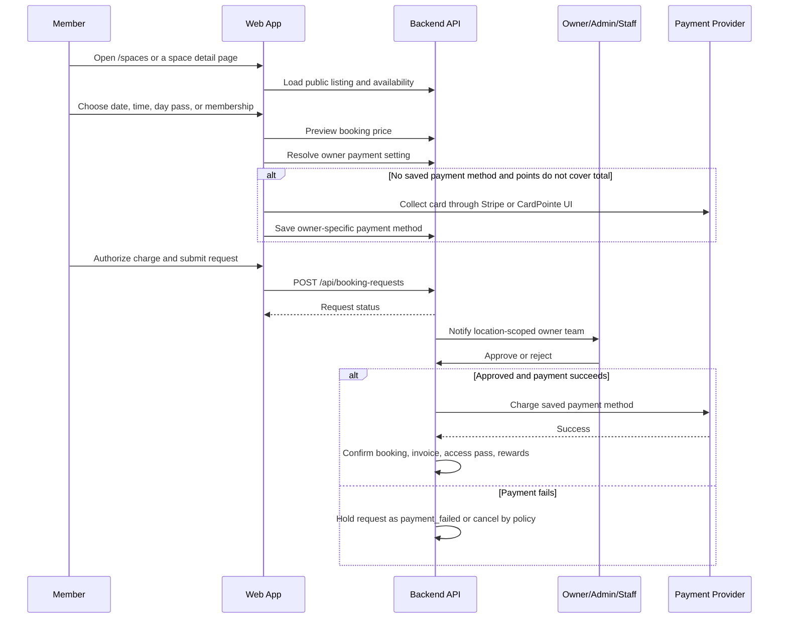
```mermaid
sequenceDiagram
  participant M as Member
  participant W as Web App
  participant API as Backend API
  participant O as Owner/Admin/Staff
  participant P as Payment Provider

  M->>W: Open /spaces or a space detail page
  W->>API: Load public listing and availability
  M->>W: Choose date, time, day pass, or membership
  W->>API: Preview booking price
  W->>API: Resolve owner payment setting
  alt No saved payment method and points do not cover total
    W->>P: Collect card through Stripe or CardPointe UI
    W->>API: Save owner-specific payment method
  end
  M->>W: Authorize charge and submit request
  W->>API: POST /api/booking-requests
  API-->>W: Request status
  API->>O: Notify location-scoped owner team
  O->>API: Approve or reject
  alt Approved and payment succeeds
    API->>P: Charge saved payment method
    P-->>API: Success
    API->>API: Confirm booking, invoice, access pass, rewards
  else Payment fails
    API->>API: Hold request as payment_failed or cancel by policy
  end
```

### Browse and request a space

1. Go to `/spaces`.
2. Search and filter marketplace listings.
3. Open a listing detail page, such as `/spaces/{space_public_id}`.
4. Review price, capacity, amenities, location, parking/transit, included
   items, support contacts, and availability.
5. Choose date and time for conference rooms, day pass for shared desks, or
   membership/lease products where available.
6. Review rewards eligibility.
7. Check card authorization.
8. Click `Request to book` or the equivalent reserve action.
9. Review checkout summary.
10. Continue. If no valid saved owner-specific payment method exists, add a
    card through Stripe/CardPointe.
11. The request appears in `/member/requests`.

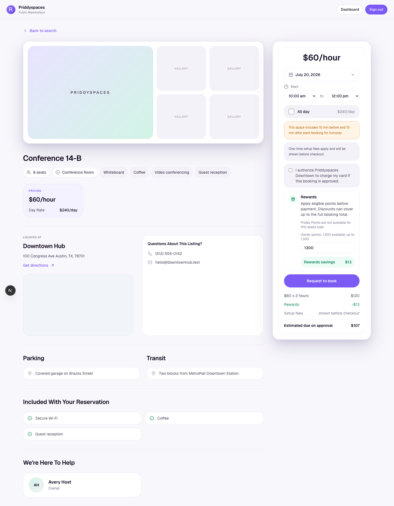

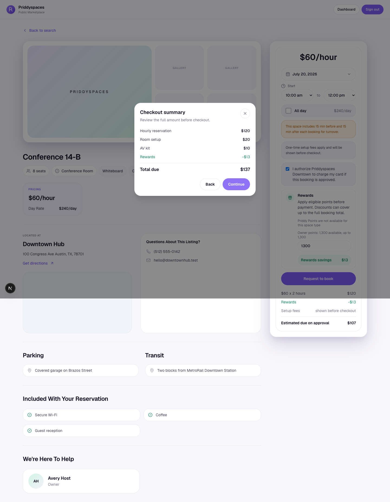

### Payment methods

Payment methods are resolved per owner and provider:

1. The space determines the payment provider by location override, organization
   override, or platform default.
2. The member's default payment method for that owner/provider is reused if
   valid.
3. If no payment method exists, the app opens the payment method modal.
4. Stripe uses a SetupIntent and Stripe card element.
5. CardPointe uses its tokenizer iframe and stores tokenized card metadata.
6. The backend stores only provider IDs/tokens and non-sensitive metadata.

Email verification is required before payment method setup and point redemption.

### Request status and invoices

Members use `/member/requests` and `/member/requests/{request_public_id}` to
track:

| Status | Meaning |
|---|---|
| `requested` | Waiting for owner/admin/staff review. |
| `approved` | Request approved and booking/payment has succeeded or is pending by policy. |
| `payment_failed` | Card charge failed; member may need to update card before retry. |
| `rejected` | Owner/admin/staff rejected the request. |
| `cancelled` | Member or operator cancelled the request, or failed-payment hold expired. |

After payment succeeds, the detail page can show payment status and invoice
links.

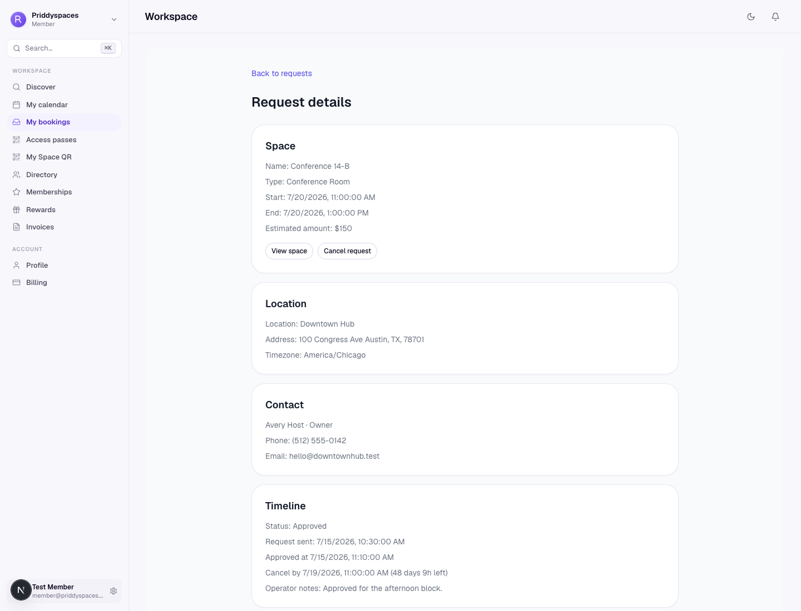

### Access passes and attendance

Confirmed bookings can create access passes. Members view passes at
`/member/access-passes`; owners/admins scan at `/owner/access-scanner` or
`/admin/access-scanner`.

Rules:

1. Passes are only valid for confirmed bookings.
2. QR payloads contain secure tokens, not raw member or booking details.
3. Check-in validates token, booking status, payment status, location scope,
   and booking window.
4. Duplicate check-ins and duplicate check-outs are blocked.
5. Owners see only assigned locations. Platform admins can scan across
   locations.

### Memberships

Members use `/member/subscriptions` to view active memberships, billing status,
past due state, and cancellation timing. Membership and lease purchase requests
also flow through booking request review, but rewards redemption is blocked for
membership and lease purchases.

### Member billing

| Route | Purpose |
|---|---|
| `/member/payments` | View payment history and booking context. |
| `/member/invoices` | View invoices and download PDFs. |
| `/member/profile` | Update member profile. |
| `/member/calendar` | View confirmed bookings in calendar form. |
| `/member/rewards` | View Priddy Points and owner-specific points. |

## Superadmin and Admin Flow

Platform users sign in through `/sign-in` and route to `/admin`.

### Superadmin review diagram

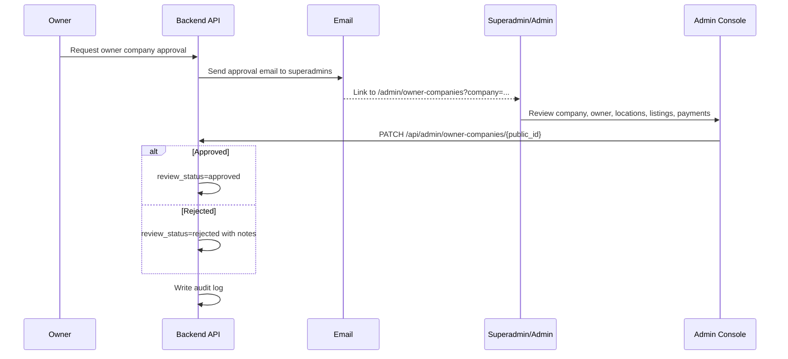
```mermaid
sequenceDiagram
  participant O as Owner
  participant API as Backend API
  participant E as Email
  participant A as Superadmin/Admin
  participant W as Admin Console

  O->>API: Request owner company approval
  API->>E: Send approval email to superadmins
  E-->>A: Link to /admin/owner-companies?company=...
  A->>W: Review company, owner, locations, listings, payments
  W->>API: PATCH /api/admin/owner-companies/{public_id}
  alt Approved
    API->>API: review_status=approved
  else Rejected
    API->>API: review_status=rejected with notes
  end
  API->>API: Write audit log
```

### Owner company approval

Superadmins and admins review owner companies at `/admin/owner-companies`.
They can:

1. Search by company name, business email, or public ID.
2. Review business details and owner identity.
3. Review locations/listings counts.
4. Review payment provider and payment blockers.
5. Add review notes.
6. Set commission override percent.
7. Approve or reject marketplace review.
8. View review history/audit context.

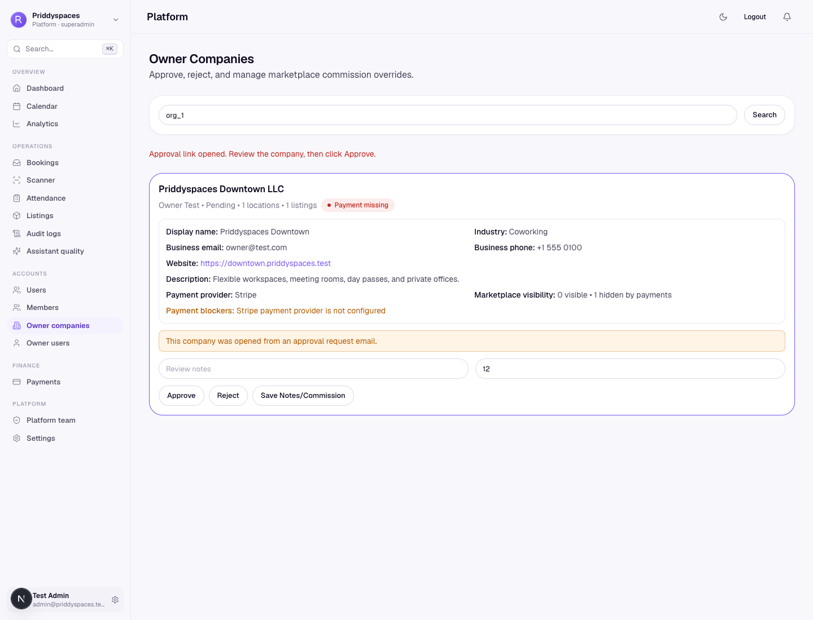

### Admin dashboard

The admin dashboard shows global platform metrics and activity:

| Metric | Meaning |
|---|---|
| Users | Total users across the platform. |
| Members | Member-role users. |
| Owner companies | Owner organizations. |
| Live listings | Active marketplace inventory. |
| Bookings | Booking records. |
| Pending requests | Requests awaiting review. |
| GMV | Gross payment volume. |
| Platform earnings | Platform fee amount after owner payouts. |

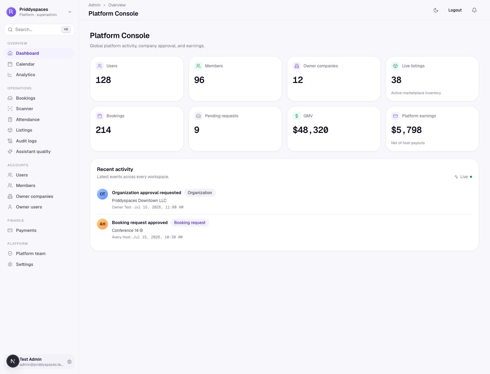

### Superadmin-only platform settings

Superadmins can open `/admin/settings` to manage:

1. Default owner commission percentage.
2. Priddy Points enablement.
3. Priddy signup points.
4. Priddy point value.
5. Platform-allowed Priddy Points space types.
6. Platform-allowed Priddy Points booking modes.
7. Admin profile and password sections.

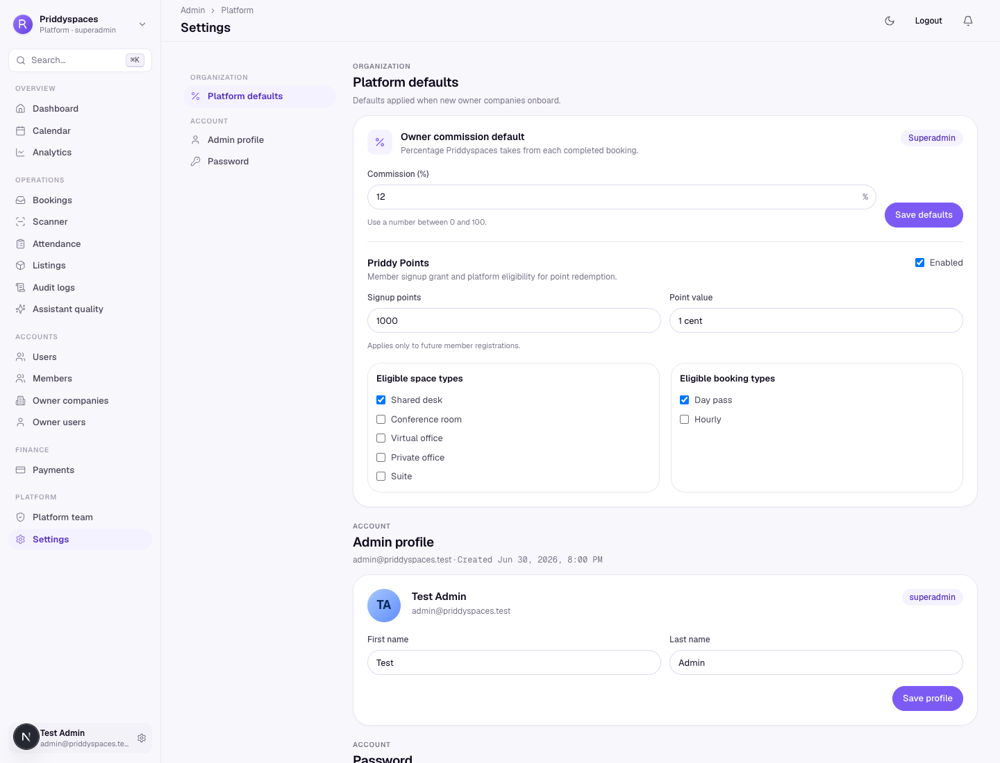

### Platform team

Superadmins can manage platform team membership at `/admin/platform-team`.
The backend prevents removing the last active superadmin and writes audit logs
for platform team role changes.

### Other admin capabilities

| Area | Route | Capability |
|---|---|---|
| Calendar | `/admin/calendar` | Cross-platform booking calendar. |
| Analytics | `/admin/analytics` | Platform, city, leaderboard, and report views. |
| Members | `/admin/members` | Member directory and detail pages. |
| Owner users | `/admin/owner-users` | Owner user list and owner user detail pages. |
| Listings | `/admin/listings` | Platform-wide listing visibility and status review. |
| Bookings | `/admin/bookings` | Platform-wide booking/request inspection. |
| Payments | `/admin/payments` | Payment, failed payment, GMV, and owner payout context. |
| Assistant quality | `/admin/assistant-quality` | Assistant evaluations and quality events. |
| Audit logs | `/admin/audit-logs` | Review system and admin actions. |
| Impersonation | API-backed admin action | Start/stop support impersonation for non-platform users. |
| Scanner | `/admin/access-scanner` | Scan access passes across locations. |
| Attendance | `/admin/attendance` | Attendance and currently checked-in views. |

Support role should be treated as read-oriented. Superadmin-only capabilities
include platform team and platform settings.

## Rewards

Rewards are split into two systems:

| Reward type | Owner | Balance scope | Where member sees it |
|---|---|---|---|
| Priddy Points | Platform | One platform wallet per member | `/member/rewards` |
| Owner points | Workspace owner organization | One wallet per member per owner organization | `/member/rewards` |

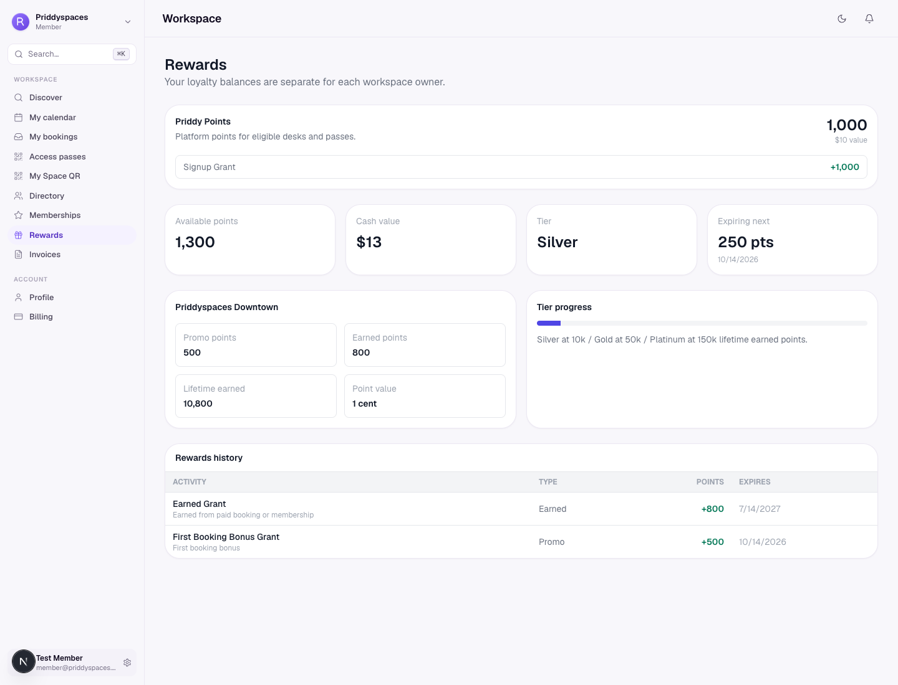

### Rewards lifecycle diagram

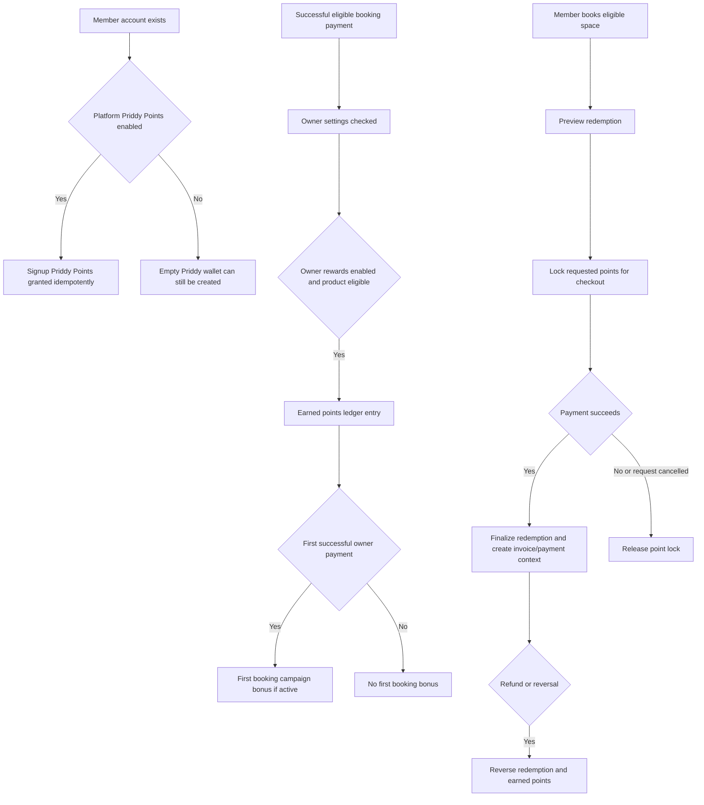
```mermaid
flowchart TD
  A["Member account exists"] --> B{"Platform Priddy Points enabled"}
  B -->|"Yes"| C["Signup Priddy Points granted idempotently"]
  B -->|"No"| D["Empty Priddy wallet can still be created"]
  E["Successful eligible booking payment"] --> F["Owner settings checked"]
  F --> G{"Owner rewards enabled and product eligible"}
  G -->|"Yes"| H["Earned points ledger entry"]
  H --> I{"First successful owner payment"}
  I -->|"Yes"| J["First booking campaign bonus if active"]
  I -->|"No"| K["No first booking bonus"]
  L["Member books eligible space"] --> M["Preview redemption"]
  M --> N["Lock requested points for checkout"]
  N --> O{"Payment succeeds"}
  O -->|"Yes"| P["Finalize redemption and create invoice/payment context"]
  O -->|"No or request cancelled"| Q["Release point lock"]
  P --> R{"Refund or reversal"}
  R -->|"Yes"| S["Reverse redemption and earned points"]
```

### Platform Priddy Points

Superadmins configure Priddy Points in `/admin/settings`:

1. Enable or disable Priddy Points.
2. Set signup grant points.
3. Set point value in cents.
4. Restrict eligible space types.
5. Restrict eligible booking modes.

Default platform eligibility in the backend is shared desk day passes unless
settings expand it.

### Owner rewards

Owners configure rewards in `/owner/loyalty`:

1. Enable workspace rewards.
2. Allow or disallow Priddy Points acceptance.
3. Enable owner-point redemption.
4. Set point value.
5. Set earn points per `$100`.
6. Set max redemption percent.
7. Set promo and earned point expiration.
8. Set campaign daily issue cap.
9. Set max promo grant.
10. Choose eligible owner space types and booking modes.
11. Create campaigns.
12. Manually grant promo or earned points to members who have interacted with
    the organization.

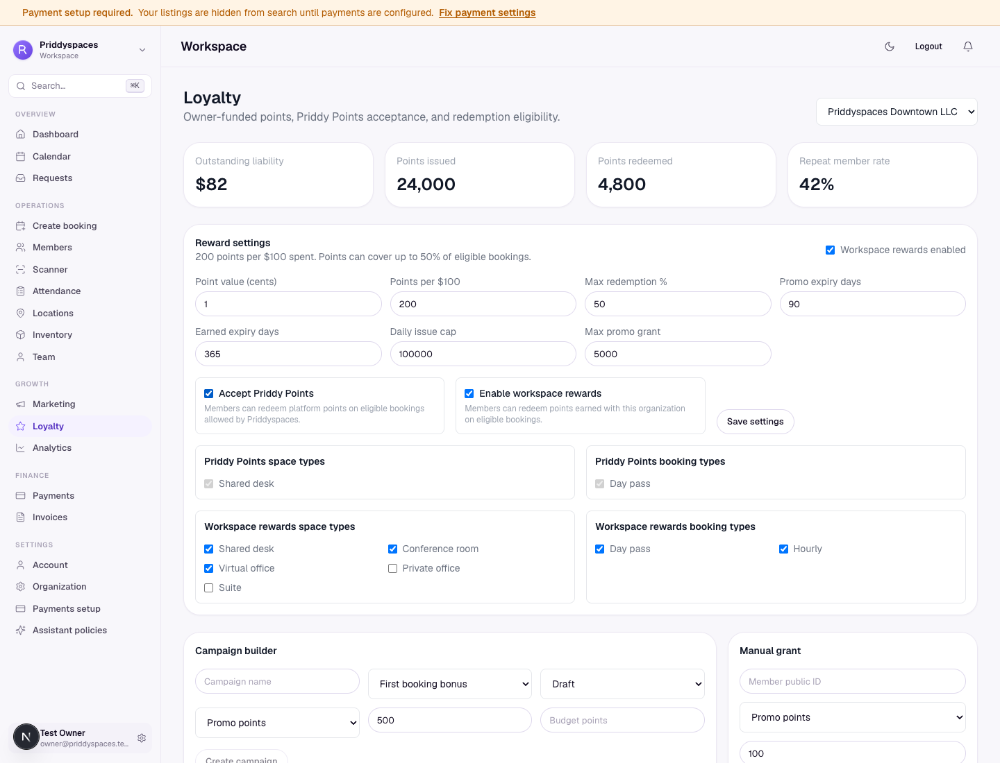

### Earning points

Points are recorded after successful eligible payment:

1. Payment must be `succeeded`.
2. Payment must be tied to a user and organization.
3. Owner rewards must be enabled.
4. Space type and booking mode must be allowed.
5. Earned points are calculated from net amount and owner earn rate.
6. First successful owner payment can trigger active `first_booking_bonus`
   campaigns.

### Redeeming points

Before booking, the member sees a redemption preview:

1. Backend calculates booking subtotal including setup fees and taxes.
2. Backend checks Priddy Points platform eligibility and owner acceptance.
3. Backend checks owner-point eligibility.
4. Backend caps redemption by available balance, point value, and max
   redemption percent.
5. When the member submits, points are locked for the booking request.
6. On successful payment, the lock is finalized into a redemption.
7. If the request is rejected, cancelled, expires, or payment fails, the lock is
   released.

Rewards redemption requires an authenticated member account and verified email.
Guest checkout cannot redeem points, and membership or lease purchases reject
rewards redemption.

### Tiers and expiry

Owner-specific earned lifetime points determine tier:

| Tier | Lifetime earned points |
|---|---|
| Bronze | Less than 10,000 |
| Silver | 10,000+ |
| Gold | 50,000+ |
| Platinum | 150,000+ |

Promo and earned points can have separate expiration windows. The member reward
page shows available points, cash value, tier, next expiration, and transaction
history.

### Refund and reversal behavior

When a booking payment is refunded or reversed:

1. Finalized point redemptions are reversed back to the wallet.
2. Earned grants from the refunded payment are reversed.
3. Ledger entries use idempotency keys to avoid duplicate grants or reversals.

## Functional Coverage Completed So Far

The current codebase includes these major flows:

| Functional area | Current support |
|---|---|
| Clerk auth and onboarding | Member and owner sign-up, owner invite URL, role metadata, `/dashboard` role router. |
| Organization onboarding | Owner organization creation, pending review status, default amenities, approval emails. |
| Location setup | Address, timezone, public contact details, working hours, amenities, booking granularity. |
| Space setup | Space type, capacity, visibility, hourly/day pricing, availability, buffers, setup fees, media and terms managers. |
| Marketplace visibility | Public listings depend on organization approval, active locations, public active spaces, and payment readiness. |
| Payments | Owner Stripe/CardPointe settings, provider overrides, member owner-specific payment methods, booking charges, invoices, refunds/reversals. |
| Booking requests | Manual and auto approval modes, owner request review, guest checkout, owner-created bookings, payment retry/hold handling. |
| Access passes | QR token generation for confirmed bookings, scanner, check-in/check-out, attendance records. |
| Notifications | In-app notifications, web/Expo push subscriptions, booking start/end reminders, owner team notification preferences. |
| Rewards | Priddy Points, owner wallets, campaigns, manual grants, earn/redemption/lock/finalize/reversal flows. |
| Admin console | Dashboard, owner companies, users, members, listings, bookings, payments, analytics, assistant quality, audit logs, platform team/settings. |
| Marketing | Owner campaigns, templates, segments, workflows, suppressions, and settings. |
| Assistant | Marketplace search assistance, owner operations support, policy knowledge, billing summaries, quality events. |

## Screenshot Index

| Screenshot | File |
|---|---|
| Member onboarding | `docs/assets/priddyspaces-role-flow-guide/01-member-onboarding.png` |
| Owner onboarding | `docs/assets/priddyspaces-role-flow-guide/02-owner-onboarding.png` |
| Owner create location | `docs/assets/priddyspaces-role-flow-guide/03-owner-create-location.png` |
| Owner create space | `docs/assets/priddyspaces-role-flow-guide/04-owner-create-space.png` |
| Owner payment settings | `docs/assets/priddyspaces-role-flow-guide/05-owner-payment-settings.png` |
| Owner approval request | `docs/assets/priddyspaces-role-flow-guide/06-owner-locations-approval-request.png` |
| Admin owner approval | `docs/assets/priddyspaces-role-flow-guide/07-admin-owner-company-approval.png` |
| Member booking page | `docs/assets/priddyspaces-role-flow-guide/08-member-space-detail-booking.png` |
| Checkout summary | `docs/assets/priddyspaces-role-flow-guide/09-member-checkout-summary.png` |
| Owner request review | `docs/assets/priddyspaces-role-flow-guide/10-owner-request-review.png` |
| Member request detail | `docs/assets/priddyspaces-role-flow-guide/11-member-request-detail.png` |
| Owner loyalty | `docs/assets/priddyspaces-role-flow-guide/12-owner-loyalty.png` |
| Member rewards | `docs/assets/priddyspaces-role-flow-guide/13-member-rewards.png` |
| Admin rewards settings | `docs/assets/priddyspaces-role-flow-guide/14-admin-settings-rewards.png` |
| Admin dashboard | `docs/assets/priddyspaces-role-flow-guide/15-admin-dashboard.png` |

## Screenshot Limitations

The screenshots use local mocked data and do not show:

1. Clerk's real hosted sign-up, sign-in, MFA, or email verification screens.
2. Stripe's real card element network behavior.
3. CardPointe's live tokenizer iframe.
4. Real email delivery, SMS, calendar APIs, map/geocoding APIs, or webhooks.

Those external services should be verified in a configured test/staging
environment before production launch.
